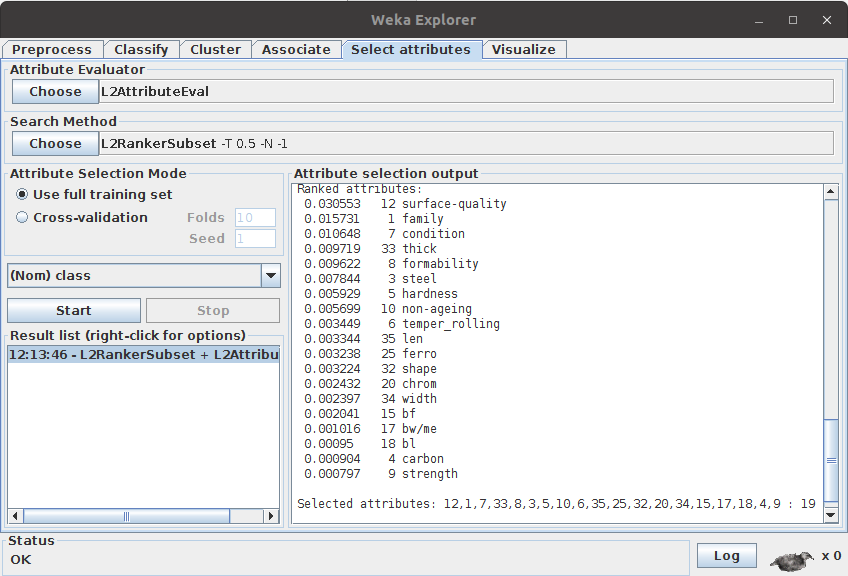
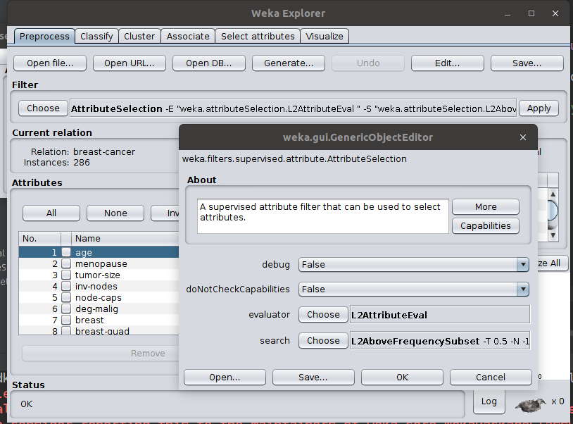

## L2: Least Loss Attribute Selection Method

### A New Feature Selection Method based on Simplified Observed and Expected Likelihoods Distance
One of the major issues faced by domain experts in processing datasets for knowledge discovery and data analytics is determining the set of relevant variables prior to data processing.  Discarding influential variables or keeping irrelevant variables has significant effects on the performance of the learning algorithm during knowledge discovery. More importantly, a wrong choice of features may reduce the quality of the outcome. In this work, a feature selection method called Least Loss (L2) is proposed. L2 method reduces the dimensionality of data by disposing irrelevant variables in a robust manner without reducing the predictive performance of classifiers. The biggest strength of the method is its simplicity and intuitiveness in which it quantifies the distance between the observed and expected probabilities, then generates new scores for each independent variable. To evaluate the new method, we compared its performance against Information Gain (IG) and Chi Square (CHI) feature selection methods using 27 different datasets. A probabilistic classifier, called Naïve Bayes (NB), was employed to produce classifiers against the different feature sets derived by the feature selection methods under consideration. Results revealed that L2 is highly competitive with respect to error rate, precision, recall rates, and substantially reduces the number of chosen variables on the datasets considered. This study will be of high interest to data analysts, scholars and domain experts who deal with big data applications. 

***Keywords:*** Classification, Data Mining, Dimensionality reduction, Feature selection, Machine Learning, Ranking of variables

//TODO
***Authors***: Fadi, Fairuz, Suhel,and Reza. 

Sample preliminary raw results for test experiments can be downloaded from [data/experiments](data/experiments)
## Requirement

* Java virtual machine: Java8 or Java9
* [Optional] WEKA tool (download it from [www.cs.waikato.ac.nz/ml/weka](https://www.cs.waikato.ac.nz/ml/weka/downloading.html)

## Running L2 method

* Download  [WekaL2.jar](downloads/wekaL2-1.0.jar "downloads/wekaL2-x.x.jar")  file and double click on it.
 Also, you can run it using the command:
 
 ```bash
 java -jar wekaL2-1.0.jar
 ```
  This will open WEKA with L2 included as an attribute selection method
* Datasets are available on [UCI](http://repository.seasr.org/Datasets/UCI/arff/) or on the cached copy in [data/arff](data/arff) folder.

* Open dataset by choosing “open file” under “pre process” tab page of WEKA explorer.

* Click on Select Attribute tab page

* In the Attribute Evaluator option choose “L2AttributeVal”

* In the Search Method option choose L2RankerSubset. The default value is 0.5. To change it, double click on the search method name.



* L2RankerSubset can be used with any rank evaluation method, such as ChiSquaredAttributeEval, InfoGainAttributeEval, etc.

* L2 can be used with classifiers by applying it as an evaluation method in the supervised "AttributeSelection" filter. 


